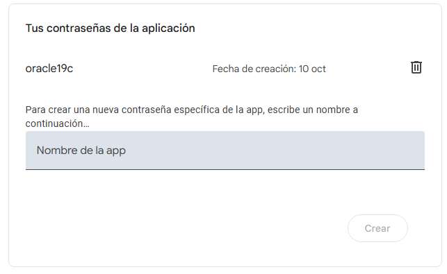
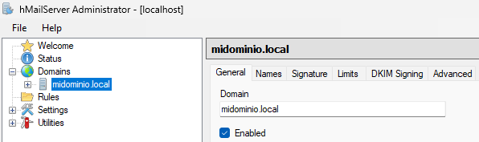
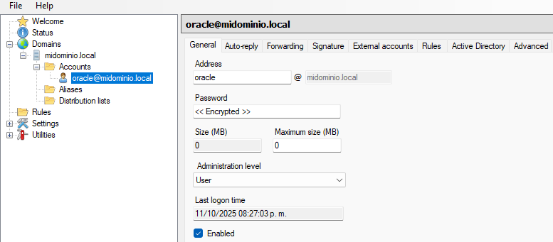
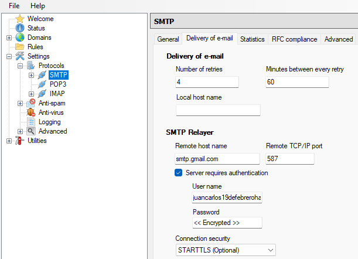

# Guia de configuracion envio correos Oracle19c

## Indice

## Conceptos

SMPT (Simple Mail Transfer Protocol)
CDB (Container Database): Base de datos principal que puede contener varios PDBs.
PDB (Pluggable Database): Base de datos enchufable, aislada, que comparte recursos con el CDB.

relaying: retrasmision

## Inciar session

PDB: UNA, ORCLPDB

user/password@PDB
user/password@PDB as rol

```sql+
sys/admin@ORCLPDB as sysdba
```

```cmd
sqlplus sys/admin@ORCLPDB as sysdba
```

## Habilitar funciones de SMPT

Instalar UTL_MAIL si no está instalado (ejecutar desde SQL*Plus como sysdba)

```cmd
@C:\Oracle19c\RDBMS\ADMIN\utlmail.sql
@C:\Oracle19c\RDBMS\ADMIN\prvtmail.plb
```

```bash
SQL> @$ORACLE_HOME/javavm/install/initjvm.sql
SQL> @$ORACLE_HOME/rdbms/admin/initplsj.sql
```

referencia: <https://oracle-base.com/articles/misc/email-from-oracle-plsql>

## Contraseñas de aplicaciones en cuenta de google

Para tener acceso al SMPT de google mediante la cuenta propia, teniendo en cuenta las limitaciones de la propia cuenta ~500 correos por dia

1. ir a cuenta de google
2. seguridad -> (Cómo acceder a Google) verificacion de 2 pasos
3. Habilita verificacion de 2 pasos
4. seguridad -> verificacion de 2 pasos -> Contraseñas de aplicaciones
5. asigna un nombre y genera la contraseña. Guardala, solo se muestra una vez

equivale a una contraseña de acceso completo. da acceso a la cuenta completa de google



## Configurar un servidor SMPT

* Oracle se conecta a `localhost:25` **sin TLS ni wallet**.
* hMailServer reenvía (relay) los correos a Internet y maneja TLS/ certificados hacia otros servidores si es necesario (como gmail).
* Es gratuito, fácil de instalar en Windows y configurable para enviar correos reales que lleguen a Gmail/telefono.
* pesa ~4MB

### 1) Instalación de hMailServer (Windows)

1. Descarga e instala hMailServer: [https://www.hmailserver.com](https://www.hmailserver.com) (elige la versión estable).
2. Durante instalación, crea una contraseña para el administrador del panel.
3. Abre hMailServer y conecta con el host por defecto con la contraseña creada.

### 2) Configuración básica de hMailServer

Configuración mínima dentro de hMailServer Admin:

* Domains → Add:

  * Domain: `midominio.local` (puede ser un dominio real si tienes uno; para pruebas puedes usar `local`).

    

  * Accounts → Create account:
  * Address: `oracle@midominio.local`
  * Password: `tu_password_oracle`

    

* Settings → Protocols → SMTP:

  * Marca que **no** requiera SSL/TLS para conexiones locales (por defecto hMail escucha en 25 sin TLS).
  * Configura para que se envie el correo mediante google

    settings → Protocols → SMTP → Delivery of e-mail

    ```
        SMTP Relayer:
        Remote host name: smtp.gmail.com
        Port: 587
        Server requires authentication: ✅
        Username: tu_correo@gmail.com
        Password: (clave de aplicación, no la clave normal)
        Use STARTTLS (Optional): ✅
    ```

    

    Alternativa:
    * Asegúrate que la IP local (`127.0.0.1`) tenga permiso para `Send` y `Relay` si quieres permitir relaying desde Oracle.
      * Settings → Delivery of e-mail → SMTP relayer:

      * (Opcional) Si tu ISP bloquea salida o quieres asegurarte de entrega, configura un relay SMTP (por ejemplo el SMTP de tu proveedor de correo o un servicio transaccional). Si no, hMail intentará entrega directa.
      * Settings → Security → Add your Oracle server IP (por ejemplo 127.0.0.1) en “Allow” si hay restricciones.
      * Guarda cambios y arranca el servicio (Services → hMailServer).

        Nota: si quieres que los correos parezcan enviados desde un dominio real (menos spam), usa un dominio que controles y configura DNS (MX, SPF, PTR). Para pruebas, no es imprescindible.

### 3) Firewall / NAT

* En la máquina donde está hMailServer, asegúrate que el puerto **25 (SMTP)** esté abierto para conexiones locales (y externas solo si quieres recibir).
* Oracle y hMailServer en la misma máquina: no necesitas abrir nada adicional para localhost.

#### Pasos: Abrir el puerto 25 en el Firewall de Windows

Para entrade del puerto 25

1. Pulsa **Inicio** y escribe:
   `Firewall de Windows con seguridad avanzada`
2. En el panel izquierdo haz clic en:
   **Reglas de entrada**
3. A la derecha, selecciona:
   **Nueva regla...**
4. Elige:
   ✅ **Puertos**
5. Selecciona:
   ✅ **TCP**
   ✅ **Puerto específico:** escribe `25`
6. Haz clic en:
   ✅ **Permitir la conexión**
7. Marca las opciones necesarias (recomendado):

   * **Privado**
   * **Dominio**
     *(Evita Público si no es necesario)*
8. Ponle un nombre, por ejemplo:
   `SMTP hMailServer (Puerto 25)`
9. Guardar.

**Nota: de ser requerido hacerlo para SALIDA del puerto 587, si ocurre un error al enviar.**

### 4) Código PL/SQL en Oracle (sin wallet, vía localhost:25)

Este ejemplo usa `UTL_SMTP` y NO requiere wallet ni STARTTLS:

```plsql
DECLARE
  l_conn   UTL_SMTP.connection;
  crlf     VARCHAR2(2) := UTL_TCP.CRLF;
BEGIN
  -- Conectar a hMailServer en la misma máquina (sin TLS)
  l_conn := UTL_SMTP.open_connection(host => '127.0.0.1', port => 25);

  UTL_SMTP.helo(l_conn, 'mi-servidor-oracle'); -- identifica tu host
  -- Si tu hMailServer requiere autenticación, usa UTL_SMTP.auth:
  -- UTL_SMTP.auth(l_conn, 'oracle@midominio.local', 'tu_password_oracle');

  UTL_SMTP.mail(l_conn, 'oracle@midominio.local'); -- remitente
  UTL_SMTP.rcpt(l_conn, 'tu_telefono@gmail.com');  -- destinatario real

  UTL_SMTP.open_data(l_conn);
  UTL_SMTP.write_data(l_conn,
     'From: "Oracle" <oracle@midominio.local>' || crlf ||
     'To: tu_telefono@gmail.com' || crlf ||
     'Subject: Prueba Oracle -> hMailServer' || crlf || crlf ||
     'Hola, este es un correo enviado desde Oracle a través de hMailServer.' || crlf
  );
  UTL_SMTP.close_data(l_conn);
  UTL_SMTP.quit(l_conn);

  DBMS_OUTPUT.PUT_LINE('Correo enviado al relay local (hMailServer).');
EXCEPTION
  WHEN OTHERS THEN
    DBMS_OUTPUT.PUT_LINE('Error: ' || SQLERRM);
    BEGIN
      IF l_conn IS NOT NULL THEN
        UTL_SMTP.quit(l_conn);
      END IF;
    EXCEPTION WHEN OTHERS THEN NULL;
    END;
END;
/

DECLARE
    -- Configuración
    c_smtp_host   CONSTANT VARCHAR2(50) := '127.0.0.1';
    c_smtp_port   CONSTANT PLS_INTEGER  := 25;
    c_helo_domain CONSTANT VARCHAR2(50) := 'mi-servidor-oracle';

    c_sender      CONSTANT VARCHAR2(100) := 'oracle@midominio.local';
    c_recipient   CONSTANT VARCHAR2(100) := 'tu_telefono@gmail.com';
    c_subject     CONSTANT VARCHAR2(200) := 'Prueba Oracle -> hMailServer';
    c_body        CONSTANT VARCHAR2(1000) := 'Hola, este es un correo enviado desde Oracle a través de hMailServer.';

    l_conn UTL_SMTP.connection;
    crlf  CONSTANT VARCHAR2(2) := UTL_TCP.CRLF;

    PROCEDURE safe_quit(p_conn IN OUT UTL_SMTP.connection) IS
    BEGIN
        IF p_conn IS NOT NULL THEN
            UTL_SMTP.quit(p_conn);
        END IF;
    EXCEPTION
        WHEN OTHERS THEN
            NULL; -- Evita que un error al cerrar opaque el error original
    END safe_quit;

BEGIN
    -- 1. Abrir conexión
    l_conn := UTL_SMTP.open_connection(
                    host => c_smtp_host,
                    port => c_smtp_port
              );

    -- 2. Iniciar protocolo
    UTL_SMTP.helo(l_conn, c_helo_domain);

    -- 3. Autenticación (si aplica)
    --UTL_SMTP.auth(l_conn, 'oracle@midominio.local', 'tu_password_oracle');

    -- 4. Definir remitente y destinatario
    UTL_SMTP.mail(l_conn, c_sender);
    UTL_SMTP.rcpt(l_conn, c_recipient);

    -- 5. Redactar mensaje
    UTL_SMTP.open_data(l_conn);
    UTL_SMTP.write_data(
        l_conn,
        'From: "Oracle" <' || c_sender || '>'    || crlf ||
        'To: ' || c_recipient                    || crlf ||
        'Subject: ' || c_subject                 || crlf ||
        crlf ||
        c_body || crlf
    );
    UTL_SMTP.close_data(l_conn);

    -- 6. Cerrar conexión correctamente
    safe_quit(l_conn);

    DBMS_OUTPUT.PUT_LINE('Correo enviado correctamente.');

EXCEPTION
    WHEN OTHERS THEN
        DBMS_OUTPUT.PUT_LINE('Error al enviar correo: ' || SQLERRM);
        safe_quit(l_conn);
END;
/

```
