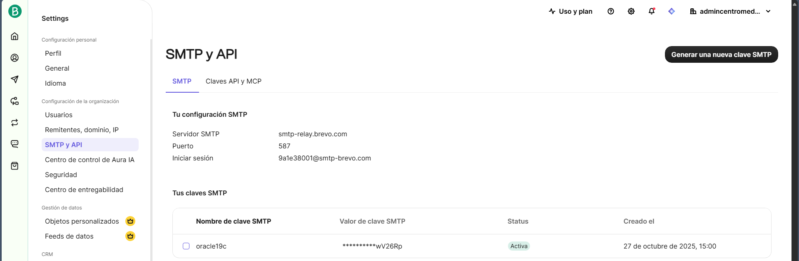

# Guia de configuracion envio correos Oracle19c

## Indice

## Conceptos

SMTP (Simple Mail Transfer Protocol)
CDB (Container Database): Base de datos principal que puede contener varios PDBs.
PDB (Pluggable Database): Base de datos enchufable, aislada, que comparte recursos con el CDB.

relaying: retrasmision

## Inciar session

PDB: UNA, ORCLPDB

user/password@PDB
user/password@PDB as rol

```sql+
sys/admin@ORCLPDB as sysdba
```

```cmd
sqlplus sys/admin@ORCLPDB as sysdba
```

## Habilitar funciones de SMTP

Instalar UTL_MAIL si no está instalado (ejecutar desde SQL*Plus como sysdba)

```cmd
@C:\Oracle19c\RDBMS\ADMIN\utlmail.sql
@C:\Oracle19c\RDBMS\ADMIN\prvtmail.plb
```

verificar que esten disponibles:

```sql
-- Verifica si el paquete UTL_MAIL está disponible
SELECT object_name, status
FROM all_objects
WHERE object_type = 'PACKAGE';
  -- AND object_name IN ('UTL_MAIL', 'UTL_SMTP');
```

referencia: <https://oracle-base.com/articles/misc/email-from-oracle-plsql>

## Configurar Brevo (servidor SMTP)

1. Inciar una cuenta de uso en brevo: <https://app.brevo.com/>
2. Agregar un correo al perfil
3. ir a configuraciones->SMTP y API y generar las crendenciales para el servidor SMTP
4. Guardar las credenciales



## Configurar un servidor SMTP, en este caso Brevo, en la base de datos

* Oracle se conecta a `smtp-relay.brevo.com` puerto `587` **sin wallet**.
* Configurar accesos al esa conexion en ese puerto
* se configura un rol o usuario que envia los correos

```SQL
-- !DATOS TABLA ACS_PARAMETROS
INSERT INTO ACS_PARAMETROS VALUES ('CORREO_DBA', 'dba@acs.com', 'Correo del DBA', 'CORREO');

INSERT INTO ACS_PARAMETROS VALUES ('SMTP_CORREO', 'juancarlos19defebrerohat@gmail.com', 'Correo para notificaciones automaticas', 'SMTP');
INSERT INTO ACS_PARAMETROS VALUES ('SMTP_HOST', 'smtp-relay.brevo.com', 'Servidor para envio de correos', 'SMTP');
INSERT INTO ACS_PARAMETROS VALUES ('SMTP_PORT', '587', 'Puerto del servidor SMTP', 'SMTP');
INSERT INTO ACS_PARAMETROS VALUES ('SMTP_USUARIO', 'a1e38001@smtp-brevo.com', 'Usuario del servidor', 'SMTP');
INSERT INTO ACS_PARAMETROS VALUES ('SMTP_CLAVE', 'bskiTLMr8wV26Rp', 'Clave servidor', 'SMTP');
INSERT INTO ACS_PARAMETROS VALUES ('SMP_ACL_FILe', 'brevo_acl.xml', 'archivo acl', 'SMTP');
INSERT INTO ACS_PARAMETROS VALUES ('', '', '', '');
COMMIT;
/

-- ** Seccion: Configuracion ACL para envio de correos via SMTP **

/*
ACL (Access Control List) es un conjunto de reglas que definen los permisos de acceso a recursos de red específicos para usuarios o roles en Oracle Database.
Estos permisos son necesarios para que los procedimientos almacenados puedan interactuar con servicios externos, como servidores SMTP para el envío de correos electrónicos.

* se puede editar el arhivo XML del ACL para agregar o modificar reglas de acceso, como se muestra en el ejemplo al inicio de este archivo.
* Control deacceso se gestiona mediante el paquete DBMS_NETWORK_ACL_ADMIN.
* Pasos para configurar ACL para el envío de correos:
    1. Eliminar ACLs previos (si existen).
    2. Crear un nuevo ACL y asignar privilegios al usuario o rol que ejecutará el procedimiento de envío de correo.
    3. Asignar el ACL al host y puerto del servidor SMTP.
    4. Verificar que el ACL se haya configurado correctamente.
    5. (Opcional) Crear un directorio para el wallet si se utiliza SSL/TLS y asignar permisos adecuados.
*/

DECLARE
    V_ACL_FILE VARCHAR2(100) := ACS_FUN_OBTENER_PARAMETRO('SMP_ACL_FILe');
BEGIN
-- * PASO 1: LIMPIAR ACLs ANTERIORES *
    DBMS_NETWORK_ACL_ADMIN.DROP_ACL(acl => V_ACL_FILE);
    DBMS_OUTPUT.PUT_LINE('[OK] ACL anterior eliminado');
EXCEPTION
    WHEN OTHERS THEN
        IF SQLCODE = -46104 THEN
            DBMS_OUTPUT.PUT_LINE('[INFO] No existía ACL previo');
        ELSE
            DBMS_OUTPUT.PUT_LINE('[WARN] Error eliminando ACL: ' || SQLERRM);
        END IF;
END;
/

DECLARE
    V_ACL_FILE VARCHAR2(100) := ACS_FUN_OBTENER_PARAMETRO('SMP_ACL_FILe');
    V_HOST VARCHAR2(100) := ACS_FUN_OBTENER_PARAMETRO('SMTP_HOST');
    V_PORT NUMBER := TO_NUMBER(ACS_FUN_OBTENER_PARAMETRO('SMTP_PORT'));

BEGIN
-- * PASO 2: CREAR NUEVO ACL PARA USUARIO USER *
    DBMS_NETWORK_ACL_ADMIN.CREATE_ACL(
        acl         => V_ACL_FILE,
        description => 'Acceso SMTP' || ' ' || V_HOST || ':' || V_PORT,
        principal   => 'USER',
        is_grant    => TRUE,
        privilege   => 'connect'
    );
    DBMS_OUTPUT.PUT_LINE('[OK] ACL creado con privilegio CONNECT');

    DBMS_NETWORK_ACL_ADMIN.ADD_PRIVILEGE(
        acl       => V_ACL_FILE,
        principal => 'USER',
        is_grant  => TRUE,
        privilege => 'resolve'
    );
    DBMS_OUTPUT.PUT_LINE('[OK] Privilegio RESOLVE agregado');

-- * PASO 3: ASIGNAR ACL A HOST SMTP (PUERTO 587) *
    DBMS_NETWORK_ACL_ADMIN.ASSIGN_ACL(
        acl  => V_ACL_FILE,
        host => V_HOST,
        lower_port => V_PORT,
        upper_port => V_PORT
    );
    DBMS_OUTPUT.PUT_LINE('[OK] ACL asignado al puerto: ' || V_PORT);
    COMMIT;
END;
/
```

### 3) Firewall / NAT

* En la máquina donde está Oracle, asegúrate que el puerto **587 (SMTP)** esté abierto para conexiones locales (y externas solo si quieres recibir).
* Oracle en la misma máquina: no necesitas abrir nada adicional para localhost.
* adicionalmente solo permitir el dominio del SMTP

#### Pasos: Abrir el puerto 587 en el Firewall de Windows

Para entrade del puerto 587

1. Pulsa **Inicio** y escribe:
   `Firewall de Windows con seguridad avanzada`
2. En el panel izquierdo haz clic en:
   **Reglas de entrada**
3. A la derecha, selecciona:
   **Nueva regla...**
4. Elige:
   ✅ **Puertos**
5. Selecciona:
   ✅ **TCP**
   ✅ **Puerto específico:** escribe `587`
6. Haz clic en:
   ✅ **Permitir la conexión**
7. Marca las opciones necesarias (recomendado):

   * **Privado**
   * **Dominio**
     *(Evita Público si no es necesario)*

8. Ponle un nombre, por ejemplo:
   `SMTP bravo (Puerto 587)`
9. Guardar.

**Nota: de ser requerido hacerlo para SALIDA del puerto 587, si ocurre un error al enviar.**

### 4) Código PL/SQL en Oracle (sin wallet, vía localhost:587)

Este ejemplo usa `UTL_SMTP` y NO requiere wallet ni STARTTLS:

```SQL
CREATE OR REPLACE PROCEDURE ENVIAR_CORREO_NOTIFICADOR (
    P_DESTINATARIO IN VARCHAR2,
    P_ASUNTO IN VARCHAR2,
    P_MENSAJE IN VARCHAR2
) 
IS
DECLARE
    -- COSTANTES
    CRLF CONSTANT VARCHAR2(2) := UTL_TCP.CRLF;
    -- CONEXION
    MAIL_CONN UTL_SMTP.CONNECTION;
    -- VARIABLES
    V_REMITENTE VARCHAR2(100) := ACS_FN_OBTENER_PARAMETRO('SMTP_CORREO');
    V_SMTP_HOST VARCHAR2(100) := ACS_FN_OBTENER_PARAMETRO('SMTP_HOST');
    V_SMTP_PORT NUMBER := TO_NUMBER(ACS_FN_OBTENER_PARAMETRO('SMTP_PORT'));
BEGIN
    -- OBTENER PARAMETROS
    -- CONECTAR CON Brevo, LOCAL SIN TLS
    MAIL_CONN := UTL_SMTP.OPEN_CONNECTION(V_SMTP_HOST, V_SMTP_PORT);
    UTL_SMTP.HELO(MAIL_CONN, V_SMTP_HOST);
    -- DE: REMITENTE  A DESTINATARIO
    UTL_SMTP.MAIL(MAIL_CONN, V_REMITENTE);
    UTL_SMTP.RCPT(MAIL_CONN, P_DESTINATARIO);
    -- CONTENIDO DEL CORREO
    UTL_SMTP.OPEN_DATA(MAIL_CONN);
    UTL_SMTP.WRITE_DATA(MAIL_CONN, 
        'From: ' || V_REMITENTE || CRLF ||
        'To: ' || P_DESTINATARIO || CRLF ||
        'Subject: ' || P_ASUNTO || CRLF ||
        'Content-Type: text/html; charset=UTF-8' || CRLF ||
        CRLF ||
        P_MENSAJE);
    UTL_SMTP.CLOSE_DATA(MAIL_CONN);
    UTL_SMTP.QUIT(MAIL_CONN);
    DBMS_OUTPUT.PUT_LINE('[OK] Correo enviado correctamente a ' || P_DESTINATARIO);
EXCEPTION
    WHEN OTHERS THEN
        BEGIN
            IF MAIL_CONN IS NOT NULL THEN
                UTL_SMTP.QUIT(MAIL_CONN);
            END IF;
        EXCEPTION
            WHEN OTHERS THEN
                NULL;
        END;
        DBMS_OUTPUT.PUT_LINE('[ERROR] al enviar correo (ACS_PRC_CORREO_NOTIFICADOR): ' || SQLERRM);
        RAISE_APPLICATION_ERROR(-20001, '[ERROR] al enviar correo (ACS_PRC_CORREO_NOTIFICADOR): ' || SQLERRM);
END;
/
```
